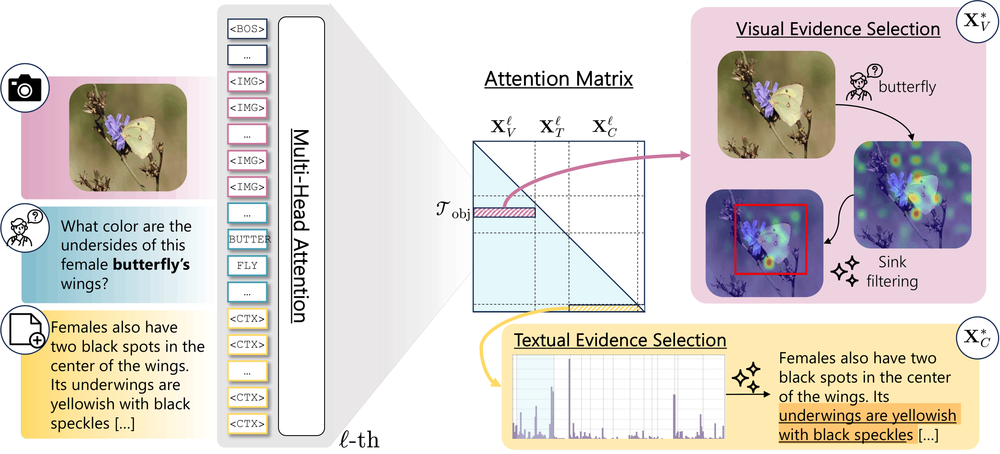

# Look Twice: Training-Free Evidence Highlighting in Multimodal Large Language Models

  
  
  

---

### 🚧 Code Coming Soon

This repository will contain the official implementation of the paper:

**"Look Twice: Training-Free Evidence Highlighting in Multimodal Large Language Models"**

---

<em>Overview of the proposed method.</em>

---

> ⭐ Star this repo to get notified when the code is released!

